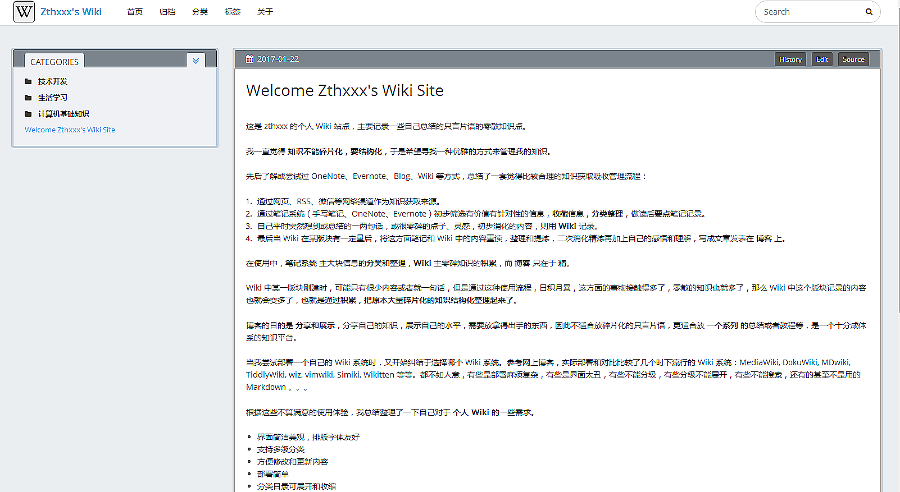
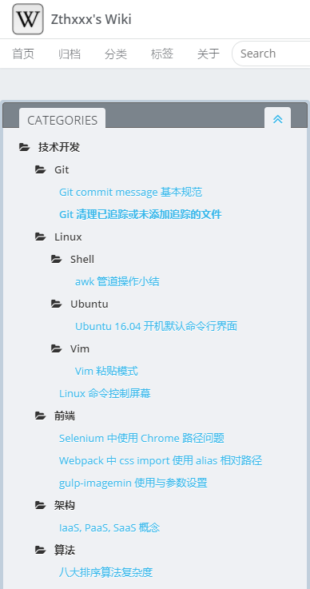
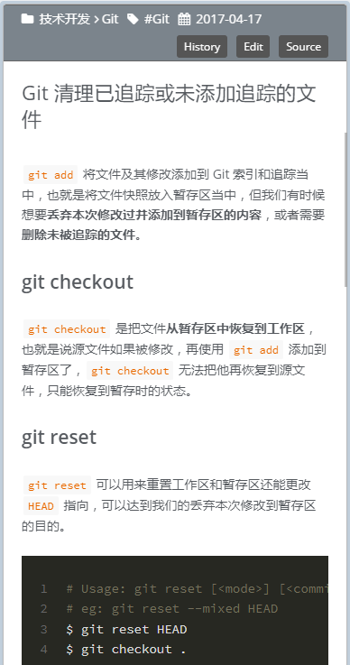

# hexo-theme-Wikitten

[English Page](./README.md)

### 一个仿 [Wikitten](https://wikitten.vizuina.com/) 样式的 Hexo 个人 wiki 系统主题。 >[预览](http://wiki.zthxxx.me/)

一些特性：

- 适用于个人 wiki 知识管理
- 简洁，双栏，分类
- 将知识多级分类整理，侧边分级展开，为思维跳转设计
- 根据文件路径自动为文章添加分类 #4




 


## 安装说明

`hexo-theme-Wikitten` 核心功能代码基于 [icarus](https://github.com/ppoffice/hexo-theme-icarus)，所以你可以在 [icarus wiki](https://github.com/ppoffice/hexo-theme-icarus/wiki) 阅读基础功能文档。

### 安装

**注意：本主题需要 Hexo v3.6 及以上版本。**

1. 进入你的 hexo 站点文件夹，克隆 `Wikitten` 主题到 `themes/` 路径下

```bash
$ cd your-hexo-directory
$ git clone https://github.com/zthxxx/hexo-theme-Wikitten.git themes/Wikitten
```

2. 覆盖站点目录中一些默认页面模板

```bash
$ cp -rf themes/Wikitten/_source/* source/
$ cp -rf themes/Wikitten/_scaffolds/* scaffolds/
```

3. 重命名主题中的 `_config.yml.example` 到 `_config.yml`，然后可以使用配置文件配置主题

```bash
$ cp -f themes/Wikitten/_config.yml.example themes/Wikitten/_config.yml
# 编辑配置文件，定制你的配置项
$ vim themes/Wikitten/_config.yml
```

大部分的配置项都和 [icarus](https://github.com/ppoffice/hexo-theme-icarus) 主题中的配置项一样，你可以首先去阅读一下 [icraus 的文档](https://github.com/ppoffice/hexo-theme-icarus/wiki)。

一些你可以开箱即用的推荐配置见下面的文档：[#Configuration](#Configuration)

4. 需要安装的插件写在主题的 [`package.json`](./package.json) 文件中

这里列出了这些插件的功能作用：

```json
hexo-autonofollow	    // 打开非本站链接时自动开启新标签页
hexo-directory-category // 根据文章文件目录自动为文章添加分类
hexo-generator-feed	    // 生成 RSS 源
hexo-generator-json-content	// 生成全站文章 json 内容，用于全文搜索
hexo-generator-sitemap	// 生成全站站点地图 sitemap
```

你可以将这些插件合并到**站点**的 `package.json` 文件中通过 `npm install` 一次安装，

或者在**站点目录**下，你可以通过以下命令安装他们：

```bash
$ npm i -S hexo-autonofollow hexo-directory-category hexo-generator-feed hexo-generator-json-content hexo-generator-sitemap
```

5. 配置mathjax渲染（可选）：

如果你在博客中需要撰写数学公式，推荐进行以下配置：

首先安装[pandoc](https://pandoc.org/installing.html)，同时在hexo站点下修改渲染引擎：

```bash
$ npm un hexo-renderer-marked --save
$ npm i hexo-rendere-pandoc --save # or hexo-renderer-krammed
```

然后将以下配置加到站点`_config.yml`文件中：

```bash
math:
  enable: true
  engine: mathjax
```


### 启用

修改站点 `_config.yml` 文件中的 `theme` 选项为 **`Wikitten`**。

### 更新

```bash
$ cd themes/Wikitten
$ git pull origin master
```


## 配置说明

在站点配置文件 `_config.yml` 中， **推荐配置为**：

```yaml
# Hexo Configuration
# URL
permalink: wiki/:title/

# Directory
skip_render:
  - README.md
  - '_posts/**/embed_page/**'

# Writing
new_post_name: :title.md # File name of new posts

## Markdown
## https://github.com/hexojs/hexo-renderer-marked
marked:
  gfm: true
  
## Plugins: https://hexo.io/plugins/
### JsonContent
jsonContent:
  meta: false
  pages:
    title: true
    date: true
    path: true
    text: true
  posts:
    title: true
    date: true
    path: true
    text: true
    tags: true
    categories: true
  ignore:
    - 404.html
    
### Creat sitemap
sitemap:
  path: sitemap.xml

### Adds nofollow attribute to all external links in your hexo blog posts automatically.
nofollow:
  enable: true
  exclude:
    - <your site url domain> # eg: zthxxx.me
```

在**主题**配置文件 `Wikitten/_config.yml` 中，你能阅读到各个选项更多的细节配置。

**在开始之前，首先请将主题配置文件示例中「我」的信息修改为「你」自己的信息，其中包括 `profile` `social_links` `history_control`等配置项。**

### `profile`、`comment`、`Share` 和 `miscellaneous` 项都是 **默认关闭的**！ 

（你任然可以打开那些选项，只是不推荐这样做。）

其他的 **推荐设置为**：

```yaml
# Customize
customize: # 首先修改这项里面的信息为你自己的各项信息
    sidebar: left # 侧边栏的所在位置，默认左边
    category_perExpand: false # 侧边栏里的各个分类是否默认全部展开
    default_index_file: index.md # 是否指定一篇文章作为首页来代替默认的多篇文章的首页，没有此项的话就会显示默认的按时间顺序排列的文章
    
# Widgets
widgets: # 挂件，默认指开启了分类这一栏
    - category
    # - recent_posts
    # - archive
    # - tag
    # - tagcloud
    # - links
    
# History version 
history_control: # 启用这一项使得 wiki 能有历史版本的功能（查看源码、在线编辑、对比历史变动）
    enable: true
    server_link: https://github.com # 版本控制服务器，推荐使用 GitHub https://github.com
    user: <your GitHub name>
    repertory: <your repertory name of this wiki source code>
    branch: <branch name of this wiki site source code>
```


## 版权协议

[MIT LICENSE](./LICENSE)


